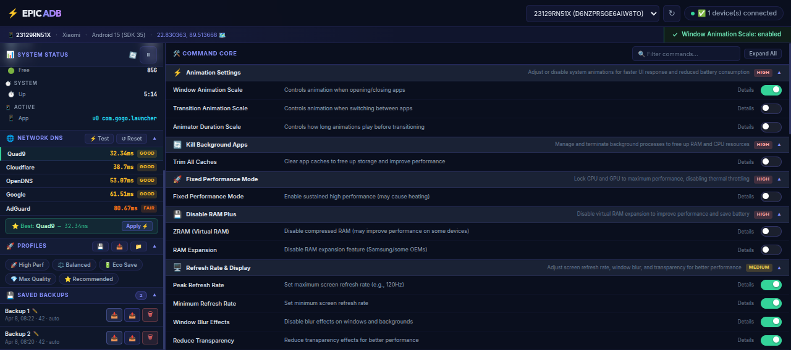

<div align="center">

# ⚡ EPIC ADB

### Android Performance Suite — Browser-Based ADB Control Panel

[](https://python.org)
[](https://flask.palletsprojects.com)
[](LICENSE)
[](https://github.com)
[](https://developer.android.com/tools/adb)

**A powerful, beautiful, locally-hosted web app that gives you full control over your Android device performance through ADB — no root required.**

[Features](#-features) · [Quick Start](#-quick-start) · [Screenshots](#-screenshots) · [Commands](#-command-library) · [Contributing](#-contributing)

---



</div>

---

## 🚀 What Is EPIC ADB?

EPIC ADB is a **locally-hosted web dashboard** that connects to your Android device via USB and lets you tune performance settings, manage app caches, set DNS, create backups, and apply one-click optimization presets — all from a beautiful, compact interface running at `http://localhost:8765`.

No cloud. No account required. No data leaves your machine.

---

## ✨ Features

| Feature | Description |
|---|---|
| 🎛️ **System Status** | Real-time battery, CPU, RAM, storage & display info |
| ⚡ **Command Core** | 40+ categorized ADB commands with toggle switches |
| 🚀 **Profiles** | One-click presets: High Perf, Balanced, Eco Save, Max Quality |
| 💾 **Saved Backups** | Backup, restore, rename & export device settings |
| 🌐 **Network DNS** | Auto DNS speed test — picks the fastest server for your region |
| 🔔 **Notification Bar** | Slide-in status notifications inside the sub-bar |
| 🔍 **Command Search** | Filter 40+ commands instantly |
| 📦 **Extensible Core** | Add unlimited ADB commands via a single Python file |

---

## 📋 Requirements

- **Python** 3.10+
- **ADB** (Android Debug Bridge) installed and in PATH
- **Android device** with USB Debugging enabled
- A **USB cable** 😄

### Install ADB

**Linux:**
```bash
sudo apt install android-tools-adb
```

**macOS:**
```bash
brew install android-platform-tools
```

**Windows:**

Download [Platform Tools](https://developer.android.com/tools/releases/platform-tools) from Google and add to PATH.

---

## ⚡ Quick Start

### 1. Clone the repo

```bash
git clone https://github.com/yourusername/epic-adb.git
cd epic-adb
```

### 2. Create virtual environment & install dependencies

```bash
# Using uv (recommended — fast)
pip install uv
uv sync

# Or using pip
pip install flask flask-cors requests
```

### 3. Enable USB Debugging on your phone

```
Settings → Developer Options → USB Debugging → ON
```

> If you don't see Developer Options: **Settings → About Phone → tap "Build Number" 7 times**

### 4. Connect your phone & run

```bash
python main.py web
```

### 5. Open in browser

```
http://localhost:8765
```

That's it. 🎉

---

## 📁 Project Structure

```
epic-adb/
├── main.py                  # Entry point — Flask server
├── pyproject.toml           # Dependencies
├── src/
│   ├── api/
│   │   └── routes.py        # All REST API endpoints
│   ├── core/
│   │   └── commands.py      # ← Add new ADB commands here
│   ├── services/
│   │   ├── device.py        # Device info & command execution
│   │   ├── profile.py       # Backup/restore/rename logic
│   │   └── dns.py           # DNS speed test
│   ├── providers/
│   │   └── adb.py           # Low-level ADB wrapper
│   ├── schema/
│   │   └── models.py        # Pydantic data models
│   └── config/              # App settings
├── static/
│   ├── index.html           # Single-page UI
│   ├── css/style.css        # All styles
│   └── js/app.js            # Frontend logic
└── profiles_data/           # Saved backup JSON files
```

---

## 🛠️ Command Library

EPIC ADB comes with 40+ commands across 10 categories:

| Category | Commands |
|---|---|
| 🎬 **Animation Settings** | Window Scale, Transition Scale, Animator Duration |
| 🧹 **Background Apps** | Trim All Caches |
| ⚙️ **Fixed Performance** | Fixed Performance Mode (thermal throttle disable) |
| 🧠 **RAM Management** | ZRAM, RAM Expansion |
| 🖥️ **Refresh Rate** | Peak/Min Refresh Rate, Window Blur, Transparency |
| 📱 **App Launch** | Process Limit, Speed Boost |
| 🔊 **Audio** | Offload Mode, A2DP optimization |
| 👆 **Touchscreen** | Long Press Timeout, Multi-press Timeout |
| 📡 **Network** | WiFi Power Save, Bluetooth Scan |
| 🔧 **System** | Force MSAA, GPU Renderer, Private DNS |

### ➕ Adding Your Own Command

Open `src/core/commands.py` and add to any category:

```python
ADBCommandModel(
    name="My Custom Command",
    description="What this does",
    enable_cmd="shell settings put global my_setting 1",
    disable_cmd="shell settings put global my_setting 0",
    get_cmd="shell settings get global my_setting",
    explanation="Detailed explanation shown in UI",
    impact="high"  # or "medium" / "low"
)
```

Restart the server. Your command appears instantly in the UI. ✅

---

## 🌐 Network DNS

On device connect, EPIC ADB automatically runs a DNS speed test and ranks:

- **Cloudflare** (1.1.1.1)
- **Google** (8.8.8.8)
- **Quad9** (9.9.9.9)
- **OpenDNS**
- **AdGuard**

The fastest one is highlighted and can be applied with one click. You can re-run the test anytime with the **⚡ Test** button.

---

## 💾 Backup & Restore

1. Click **💾** in the Profiles header to snapshot all current settings
2. Backups appear under **Saved Backups** with timestamp & count
3. **✏️** to rename a backup (e.g., "Before XDA ROM flash")
4. **📥** to restore, **📤** to export as JSON, **🗑** to delete
5. Import someone else's profile with **📁 Import**

---

## 🔌 API Reference

EPIC ADB exposes a clean REST API (useful for scripting or integration):

| Method | Endpoint | Description |
|---|---|---|
| `GET` | `/api/devices` | List connected devices |
| `GET` | `/api/device-info/{id}` | Full device info |
| `GET` | `/api/categories` | All command categories |
| `GET` | `/api/command-states/{id}` | Current toggle states |
| `POST` | `/api/execute` | Execute an ADB command |
| `POST` | `/api/profiles/backup` | Create settings backup |
| `POST` | `/api/profiles/restore` | Restore from backup |
| `POST` | `/api/profiles/apply-preset` | Apply a preset profile |
| `POST` | `/api/profiles/rename` | Rename a backup |
| `POST` | `/api/profiles/delete` | Delete a backup |
| `POST` | `/api/profiles/export` | Export backup as JSON |
| `POST` | `/api/profiles/import` | Import backup JSON |
| `GET` | `/api/dns/test` | Run DNS speed test |
| `POST` | `/api/dns/apply` | Set DNS on device |
| `POST` | `/api/dns/reset` | Reset DNS to automatic |

---

## ⚠️ Important Notes

- **No root needed** — all commands use standard ADB shell
- **Some settings** (e.g., Fixed Performance Mode) may not work on all manufacturers
- **Animation scale** changes require Developer Options to be enabled on the device
- Device must have **USB Debugging** authorized for your PC
- Settings applied via ADB may **reset on reboot** for some commands

---

## 🤝 Contributing

Contributions are welcome! The easiest way to contribute:

1. **Add new ADB commands** in `src/core/commands.py`
2. **Fix bugs** or improve error handling
3. **Improve UI** in `static/css/style.css` or `static/js/app.js`

```bash
# Run tests
pytest tests/

# Start dev server
python main.py web
```

---

## 📲 Enable Developer Options (Step by Step)

```
1. Open Settings
2. Scroll to "About Phone"
3. Tap "Build Number" 7 times rapidly
4. Go back to Settings → Developer Options
5. Enable "USB Debugging"
6. Connect phone via USB
7. Accept the authorization prompt on your phone
8. Run: adb devices  (should show your device)
```

---

## 📄 License

MIT License — free to use, modify, and distribute.

---

<div align="center">

**Made with ❤️ for Android enthusiasts**

*If this tool helped you, give it a ⭐ on GitHub!*

</div>
